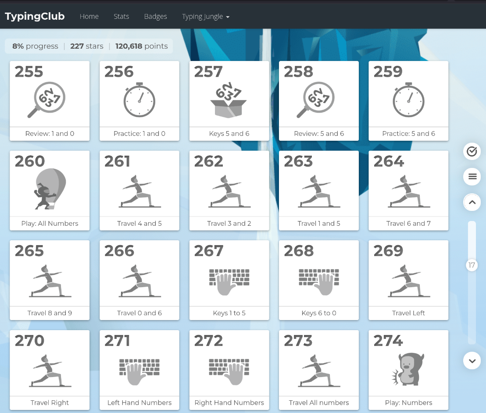

# Requirements
Overall, to master ashtadhyayi, a core set of features are needed.
1. A structured method of study. Nothing better than Dr. Pushpa Dixit's Ashtadhyayi Sahaj Bodh.
2. A structured method of revision. Ashtadhyayi is to be mastered by practice. Spaced-repetition techniques are to be used for this.
3. A structured method of assessment. Levels from 0 to mastery, with assessments at each level.
---
# The Study
- Reminds me of a site for mastering typing.

- Ashtadhyayi can similarly be seen as a collection of byte-sized lessons with extensive practice sessions
- Lessons completed in a linear way
